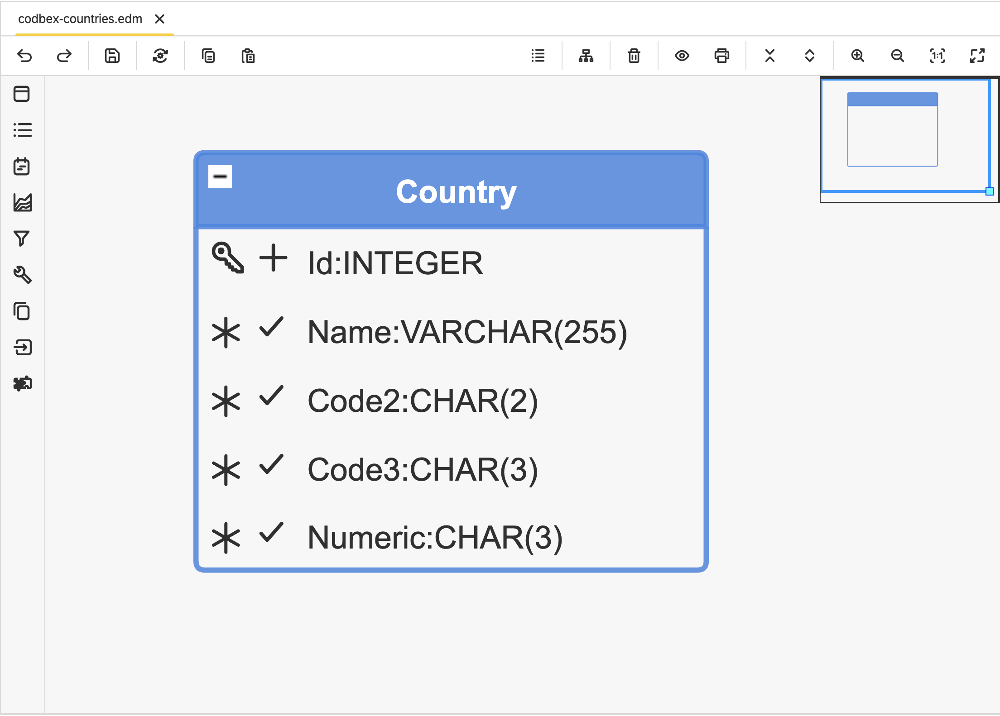

#  codbex-countries

## 📖 Table of Contents
* [🗺️ Entity Data Model (EDM)](#️-entity-data-model-edm)
* [🧩 Core Entities](#-core-entities)
* [🐳 Local Development with Docker](#-local-development-with-docker)

## 🗺️ Entity Data Model (EDM)



## 🧩 Core Entities

### Entity: `Country`

| Field   | Type     | Details                       | Description                                      |
|---------| -------- |-------------------------------| ------------------------------------------------ |
| Id      | INTEGER  | PK, Identity                  | Unique identifier for the country.              |
| Name    | VARCHAR  | Length: 255, Unique, Not Null | Name of the country.                            |
| Code2   | CHAR     | Length: 2, Unique, Not Null   | Two-character country code (ISO Alpha-2).       |
| Code3   | CHAR     | Length: 3, Unique, Not Null   | Three-character country code (ISO Alpha-3).     |
| Numeric | CHAR     | Length: 3, Unique, Not Null   | Numeric country code (ISO Numeric).             |
## 🔗 Sample Data Modules

- [codbex-countries-data](https://github.com/codbex/codbex-countries-data)

## 🐳 Local Development with Docker

When running this project inside the codbex Atlas Docker image, you must provide authentication for installing dependencies from GitHub Packages.
1. Create a GitHub Personal Access Token (PAT) with `read:packages` scope.
2. Pass `NPM_TOKEN` to the Docker container:

    ```
    docker run \
    -e NPM_TOKEN=<your_github_token> \
    --rm -p 80:80 \
    ghcr.io/codbex/codbex-atlas:latest
    ```

⚠️ **Notes**
- The `NPM_TOKEN` must be available at container runtime.
- This is required even for public packages hosted on GitHub Packages.
- Never bake the token into the Docker image or commit it to source control.